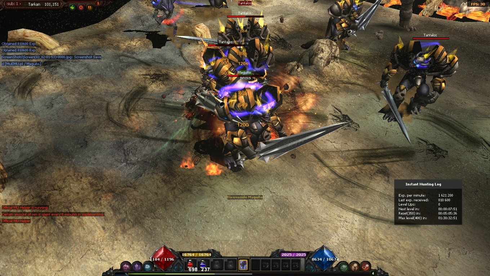
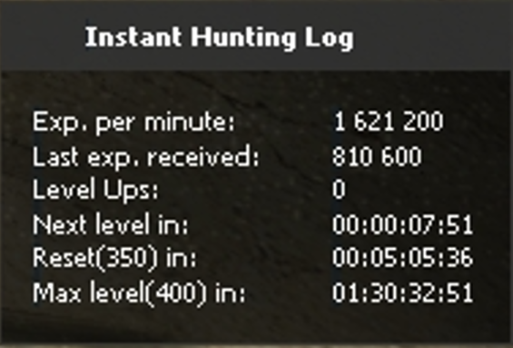

# 📜 Instant Hunting Log

A real-time experience tracking system for **Mu Online Season 6** that displays **EXP per minute**, **last EXP received**, **level-up progress**, and **estimated time to the next level**. This system provides both **server-side** and **client-side** scripts to enhance the gameplay experience.

---

## 🛠 Features

- 🔹 Displays **EXP per minute**, **last EXP received**, **level-ups**, and **estimated time for next level-ups**.
- 🔹 Uses **custom UI framework** to create a **professional-looking HUD**.
- 🔹 Automatically updates **every 60 seconds** to keep track of the player’s farming efficiency.
- 🔹 **Accurate calculations** for **EXP gain & time remaining** for level-ups.
- 🔹 Hides automatically **after 17 seconds** of not attacking(Configurable).
- 🔹 Seamlessly integrates with the **Mu Online game client and server**.
- 🔹 Uses **Lua-based scripting** for both **server-side** and **client-side** functionalities.

---

## 🚩 Known-Issues
- 🔹The hunting log UI is not properly aligned when using different resolutions
- 🔹Master level exp is not being displayed in the log

## 📷 Images




## 🏗 How It Works

The **Instant Hunting Log** is implemented using **Lua scripts** that interact with the **Mu Online** server and client.

### 🖥 Server-Side (GameServer)

- 🔹**Tracks EXP Gains**: The server tracks the player's experience **each time a monster dies**.
- 🔹**Accumulates EXP Per Minute**: Every **60 seconds**, the script records **total EXP gained per minute**.
- 🔹**Calculates Next Level Time**: Based on **EXP gain rate**, the script estimates the **time remaining** until the **next level**, **reset level (350)**, and **max level (400)**.
- 🔹**Sends Data to Client**: The server sends **EXP per minute, last EXP gained, levels gained, and time until next level** through a **custom packet**.

### 🎮 Client-Side (Game Client)

- 🔹**Receives EXP Data**: The game client listens for incoming **EXP data packets** from the server.
- 🔹**Processes the Packet Data**: Extracts **EXP per minute**, **last EXP received**, **level-ups**, and **next level time**.
- 🔹**Displays HUD**: The information is rendered **in a sleek, professional UI** using a **custom UI framework**.
- 🔹**Auto-hide Feature**: The UI automatically hides when the **EXP per minute is zero**, ensuring a **clean interface**.

---

## 📡 Packet Data Structure

The server communicates with the client using **a custom packet format** (`HUNTING_LOG_PACKET`).

| **Byte Offset** | **Data Type** | **Description** |
|---------------|------------|----------------|
| 0  | `DWORD` | **EXP per minute** |
| 4  | `DWORD` | **Last EXP received** |
| 8  | `DWORD` | **Levels gained** |
| 12 | `DWORD` | **Time (seconds) to next level** |
| 16 | `DWORD` | **Time (seconds) to max level (400)** |
| 20 | `DWORD` | **Time (seconds) to reset level (350)** |

### 🔹 Example Packet Data
```
Packet Name: HUNTING_LOG_PACKET-Player123
[0]   = 250000  (EXP per minute)
[4]   = 5000    (Last EXP received)
[8]   = 2       (Levels gained)
[12]  = 1200    (Time in seconds to next level)
[16]  = 54000   (Time in seconds to max level)
[20]  = 36000   (Time in seconds to reset level)
```
## 🔧 Installation
 
### Server-Side (GameServer)
1. Copy InstantHuntingLog.lua to:
```
..\KG_Data\Scripts\Systems\InstantHuntingLog.lua
```
2. Restart the GameServer.

### Client-Side (Game Client)
1. Copy the following scripts to:
```
..\Data\KGData\Lua\Manager\Interface\HuntingLog.lua
..\Data\KGData\Lua\Manager\Interface\UIFramework.lua
```
2. Restart the Game Client.

## 🛠 How to Contribute
We welcome contributions! Please follow these steps:

### 📂 Fork & Clone
1. Fork this repository.
2. Clone your fork locally `
git clone https://github.com/YOUR_USERNAME/instant-hunting-log
` (replace YOUR_USERNAME with your Github username)
3. cd InstantHuntingLog

### 📝 Make Changes
1. Modify the Lua scripts inside the server or client folders.
2. Test your changes in your Mu Online Game Server Locally.

### Create a Pull Request
1. Push your changes to your fork:
```
git add .
git commit -m "Improved EXP calculation"
git push origin main
```
2. Open a Pull Request on the repository.
3. Make sure to include pictures or videos of the new working changes as well as a description of the changes the PR introduces